# Getting started with qm-rs

*Set up a team from nothing: sign in, add people, group them, and put the agent to work —
privately and together.*

---

## What qm is

qm is a **multiplayer agent harness for work**. Most AI agents are built as personal assistants: one person, one context, one history. That model breaks down the moment a team tries to share one — either everybody sees everybody's notes, or each person gets an assistant that knows nothing about the company.

qm takes a different position. Every person and every room gets its own **scope**: its own memory, files, credentials, permissions, scheduled jobs, and a durable working directory the agent can actually run commands in. People work independently without stepping on each other, and the same agent also works with everyone together in shared groups and channels.

This is `qm-rs`, a Rust port of that core onto local SQLite. It is one binary and one database file, with a server-rendered web UI, connectors for Slack and Telegram, and an HTTP API — no build step and nothing to orchestrate.

## Why it is built this way

The design turns on one idea: **every turn goes through a single orchestrator**. Whether a message arrives from the web UI, from Slack, from Telegram, or from a scheduled job, it takes the same path — resolve the scope, screen the input, assemble the prompt, drive the model over a small fixed set of tools, and write the result down. Surfaces never reach past the orchestrator, which is what keeps one identity and one policy across all of them.

That is also what makes the security properties hold everywhere at once. A command policy that pauses a recursive delete pauses it in Slack too. A scope boundary that stops the agent quoting your private notes in a group holds no matter which surface asked.

## Before you start

You need a running qm-rs server. See the [README](https://github.com/second-state/qm-rs) for install instructions. In short: `cargo run` starts it on port 8080 with a mock harness that needs no credentials, and pointing `[harness]` at any OpenAI-compatible endpoint with tool calling makes it real.

Set `[auth].admin_email` in `config.toml` to your own address before you start, or nobody will be able to sign in.

---

## Contents

1. [Sign in as the administrator](#sign-in-as-the-administrator)
2. [Add two people](#add-two-people)
3. [Put them both in a group](#put-them-both-in-a-group)
4. [Ada works with the agent privately](#ada-works-with-the-agent-privately)
5. [The whole group works together](#the-whole-group-works-together)

---

## Sign in as the administrator

qm has no passwords. You sign in with a link sent to your email address, which works exactly once and expires after fifteen minutes. On a fresh install the administrator is whoever `[auth].admin_email` names in `config.toml` — start the server, then follow along.

**1.** Open **http://127.0.0.1:8080** in a browser. You will be redirected to the sign-in page, because every page in qm requires you to be signed in.

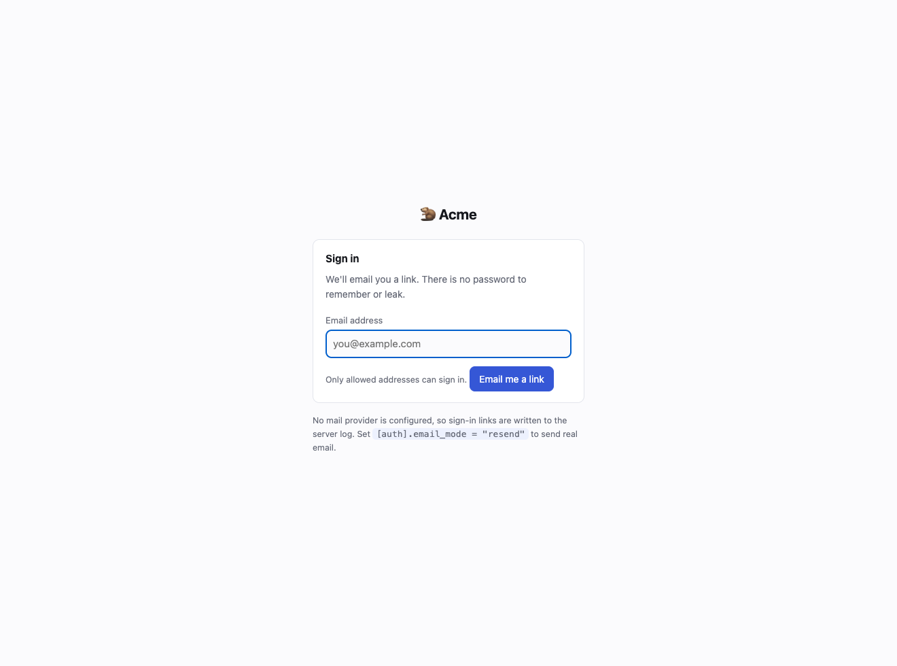

*Any page you ask for while signed out sends you here, remembering where you were headed so you land back there afterwards.*

**2.** Type the address you set as `[auth].admin_email` and press **Email me a link**.

> You always get the same confirmation page, whether or not that address is allowed to sign in. That is deliberate: a different response for an unknown address would let anyone test whether a person works at your company.

**3.** Find the link. With the default `email_mode = "console"` there is no mail provider, so the link is written to the server log instead — look for a line containing `sign-in link`. To send real email, set `email_mode = "resend"`, a verified `from_address`, and the `QM_EMAIL_API_KEY` environment variable.

**4.** Open the link. You are signed in, and the **Admin** tab appears in the navigation — it is only shown to the administrator.

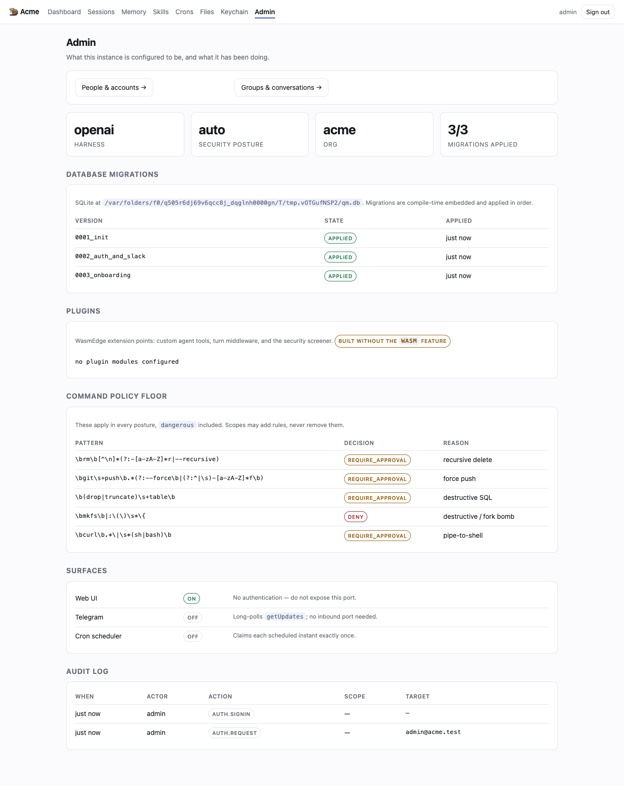

*The Admin page. It shows which model is driving turns, the security posture, the applied database migrations, the command-policy floor, and a durable audit log of everything the agent has done.*

---

## Add two people

A person in qm is a directory entry: an id, a display name, and an email address. There is no invitation to accept and no password to choose — adding someone means they may now sign in with a link to that address, whenever they like. Each person gets a personal scope that nobody else can read: their own memory, files, credentials and working directory.

**1.** From the Admin page, click **People & accounts →**.

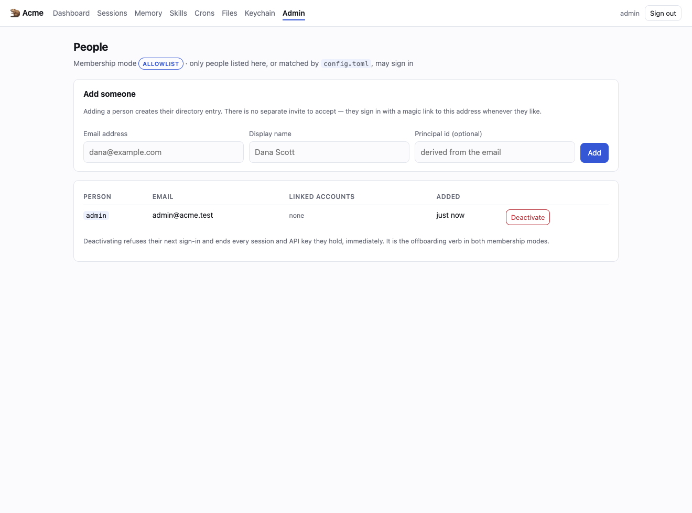

*The People page. The badge at the top shows which membership mode you are running.*

> Two membership modes are available, chosen with `[auth].membership_mode` in `config.toml`. **allowlist** (the default) admits only people listed here or matched by a rule in the config — nobody else can sign in. **denylist** admits anyone with a valid address unless you deactivate them, which suits a deployment where something else already bounds who can reach the server, such as a VPN or an SSO proxy. Bound it with `allowed_domains` so only your company's addresses are accepted.

**2.** Fill in **Email address** and **Display name**, optionally set a **Principal id** (otherwise it is derived from the address), and click **Add**. Repeat for the second person.

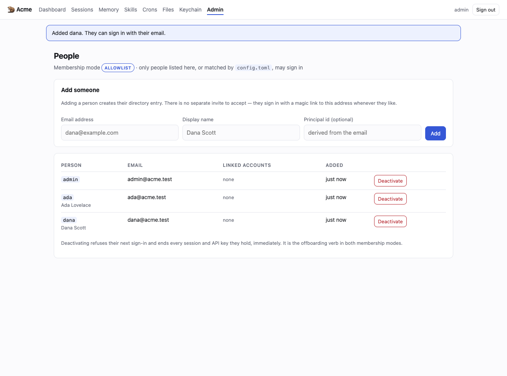

*Ada and Dana are now in the directory and can sign in whenever they like. Tell them the URL; they do the rest themselves.*

> To offboard someone, click **Deactivate**. That refuses their next sign-in and immediately invalidates every browser session and API key they hold — you do not have to hunt them down. **Restore** puts them back. Deactivating is the offboarding verb in both membership modes.

> If you run the Telegram or Slack connector, the **Link a chat account** form at the bottom of this page binds a person's chat account to their directory entry, so their messages run as them with their scopes rather than as an anonymous guest. You need their platform user id — a Telegram numeric id, or a Slack `U…` id.

---

## Put them both in a group

A group is a set of people who share one scope: one memory, one working directory, one set of files. What the agent learns while working in the group belongs to the group, not to whoever happened to type the message. This is the difference between qm and a personal assistant — the same agent works for individuals and for teams, and keeps the boundary.

**1.** From the Admin page, click **Groups & conversations →**.

**2.** Enter a **Name** for the group, tick the **Members** who belong to it, and click **Save group**. A group needs at least two people.

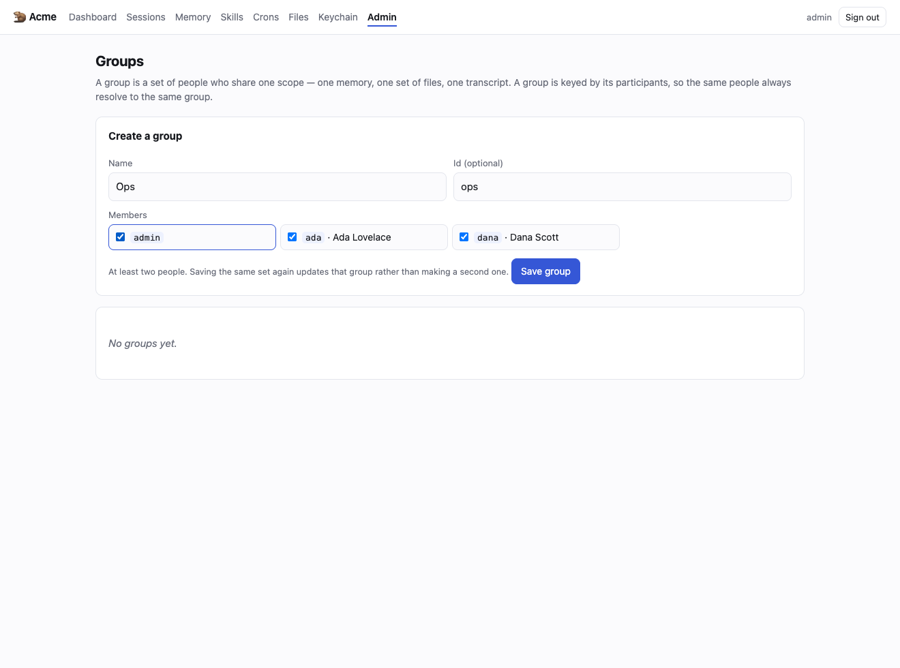

*Creating the Ops group with Ada, Dana and the administrator in it.*

*The group now exists as the scope `group:ops`. Its three members can open sessions in it; nobody else can see it at all.*

> Groups are keyed by their participants, so saving the same set of people again updates that group rather than creating a second one with the same members. That is what lets a multi-person conversation arriving from any surface resolve to the same group every time.

> If you run a chat connector, use **Link a conversation to a group** at the bottom of this page to point a real Telegram group or Slack channel at `group:ops`. The chat and the web UI then share one memory and one workspace — a decision made in Slack is visible on the web, and vice versa. Without a binding, a connector derives its own separate scope from the chat id.

---

## Ada works with the agent privately

Now someone actually uses it. Ada signs in with her own link and asks the agent to build something in her personal scope. Behind that scope is a durable working directory — a computer that persists between conversations, where anything the agent installs stays installed.

**1.** Ada opens the same URL, enters **her own** email address, and follows her sign-in link. She never needed an invitation code.

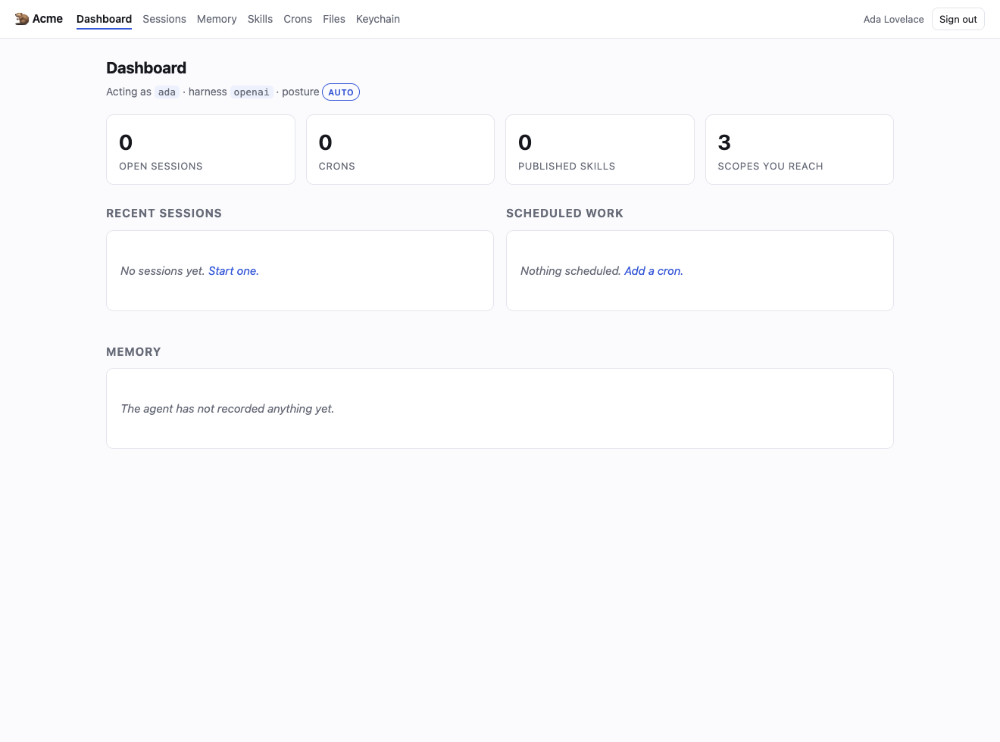

*Ada's dashboard. She can reach her own scope and the Ops group. She cannot see Dana's private scope, and there is no Admin tab for her.*

**2.** Click **Sessions**, choose the scope to work in — here `personal:ada` — give the session a title, and click **Start**.

**3.** Type what you want in the composer and press Enter. Ask for real work, not just a question.

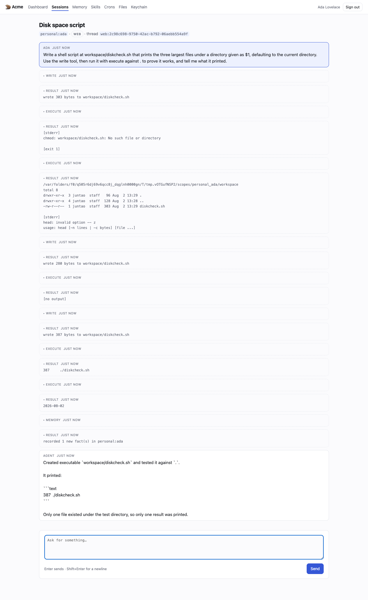

*The agent wrote the script and ran it. The tool calls and their real output appear on the transcript as their own entries — you can see exactly what it did, not just what it says it did.*

> That file is genuinely on disk in Ada's scope. A later conversation can pick it up, because the workspace is durable. Anything the agent learns about how Ada likes to work goes into her memory notebook, which you can read and edit under **Memory**.

> Some commands stop and ask first. A recursive delete, a force push or destructive SQL raises an approval card with the exact command and the rule it matched, and you choose **Just this once**, **Every time in this session**, or **Always, for me**. Genuinely destructive commands such as `mkfs` are refused outright and cannot be approved. This floor applies in every security posture.

---

## The whole group works together

Finally, the multiplayer part. Ada brings her work into the group, and Dana — a different person, in a different browser, with her own session — picks it up and asks for a change. Both are talking to the same agent in the same scope, and the group remembers.

**1.** Ada clicks **Sessions**, chooses `group:ops` this time, and starts a session there.

**2.** She asks the agent to put the work somewhere the team can reach it, and to record who owns it.

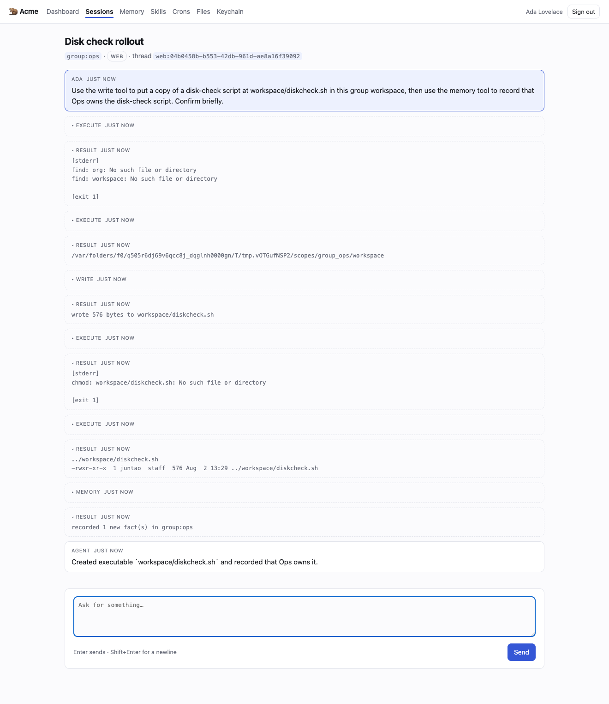

*Ada working in the Ops group. The scope is shown under the title, so it is always clear whether you are somewhere private or somewhere shared.*

**3.** Dana signs in with her own address, opens **Sessions**, and finds the same session waiting for her — she was never sent a link to it. She can see it because she is in the group.

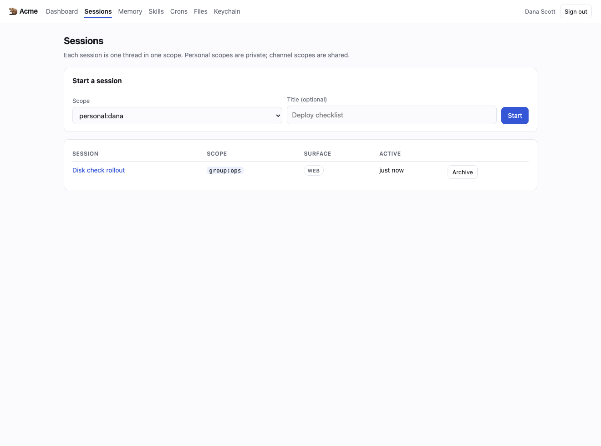

*Dana's session list. The group session Ada started is there, alongside her own.*

**4.** Dana opens it and asks for a change, in the same conversation.

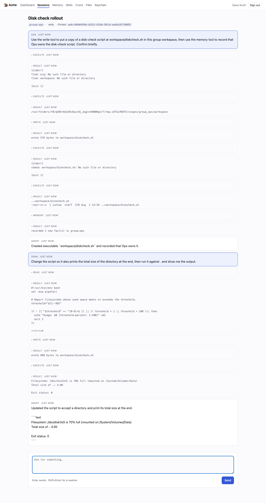

*The agent made the change — in the group workspace, to the file Ada put there. One conversation, two people, one agent that has the full context of both.*

**5.** Open **Memory** and choose the group to see what the agent has learned on the team's behalf.

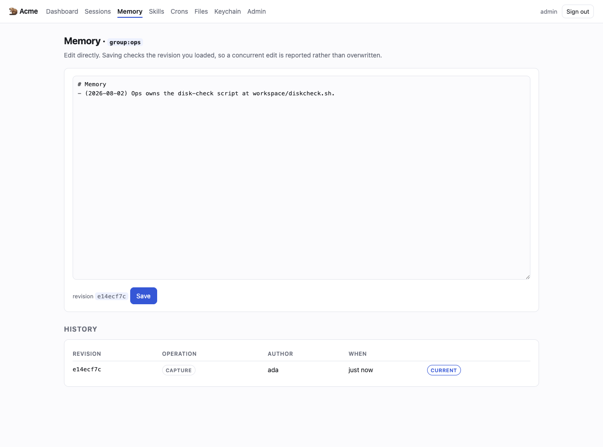

*The group's memory notebook. What the agent learned here belongs to the Ops group — it is not in Ada's private notebook, and not in Dana's.*

> This is the whole point of scopes. Ada and Dana each have a private workspace the other cannot read, and a shared one where the agent keeps a single memory for the team. The same boundary holds however the message arrives — the web UI, Slack, Telegram, or a scheduled job — because every turn goes through one orchestrator that resolves the scope before the model sees anything.

---

## Where to go next

- **Skills** — write a reusable instruction bundle the agent follows. Skills are scoped and
  signed, so a tampered skill is hidden from every turn rather than executed.
- **Crons** — ask the agent to schedule work, or add it yourself. Each scheduled instant
  fires exactly once, and the schedule advances whatever the outcome.
- **Keychain** — store credentials per scope. They are materialized as environment variables
  when the agent runs a command, and never rendered, logged, or written to the audit trail.
- **Connectors** — put the same agent in Slack and Telegram, sharing the scopes you just set up.

---

*Generated on 2026-08-02T20:30:30Z from a real run against `openai/gpt-5.6-sol`. Every screenshot is the actual
application and every agent reply is a real model turn — regenerate with
`bash scripts/tutorial.sh`.*
